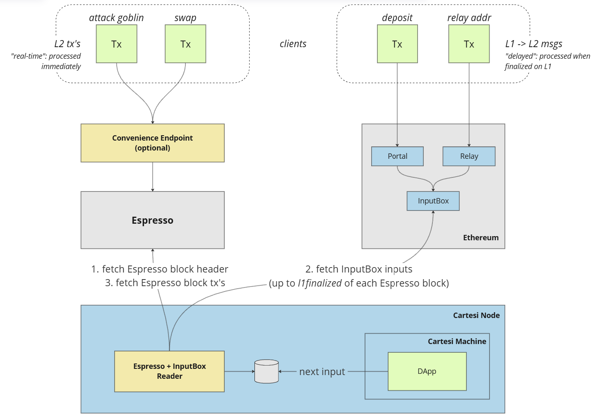

# Cartesi+Espresso Architecture

This section describes the concepts and architecture of the integration of Espresso with Cartesi Rollups.

## Concepts

### Transaction types

The Cartesi+Espresso integration is based on the concept that inputs to Cartesi applications are of two fundamentally different natures:

#### L2 transactions

These refer to common interactions of users with the application, and refer to application-specific actions such as “attack goblin”, “swap token”, “post message”, etc.; these transactions do not require any direct information or logic from the base layer;

#### L1->L2 messages

These refer to information that is relayed from the base layer to the rollup application, such as informing about deposits done via the Portals, relaying the app’s address, ensuring base layer validation for a given input, etc.

### Espresso namespaces

Espresso is designed to function as a shared sequencer for numerous rollups.
Each Espresso block can thus contain transactions for many different rollups, including non-Cartesi ones.

As such, each Cartesi application should define its own Espresso _namespace_, in order to identify itself within the Espresso Network.
Espresso namespaces are represented as 32 bit unsigned integers.
While choosing a unique namespace is desirable, namespace collision (i.e., choosing a value already used by another rollup) is not an issue: Cartesi Rollups identifies apps by their unique deployment address, and the Espresso Reader can ensure that only transactions for that address are actually processed.

## Architecture

This architecture proposes that L2 transactions are to be processed “immediately” (i.e., as soon as they are sequenced), whereas L1->L2 messages are only processed when they are finalized on L1, meaning that they are processed “with a delay”.

As illustrated above, the Espresso Reader component follows the Espresso Network, fetching Espresso block headers as they become available.
Each Espresso block header contains a reference to the current finalized base layer block (`l1finalized`). With this information, the framework can fetch all InputBox inputs (L1->L2 messages) that were sent to the base layer up to that finalized L1 block.
Finally, all L2 transactions from the Espresso block are processed.

## Considerations about fraud proof systems

This implementation takes into consideration that Cartesi Rollups currently do not enable actual fraud proof disputes.
Once fraud proofs are available, the above architecture will be changed, and most of the logic of the Espresso Reader shall be moved inside the Cartesi Machine (at least when running disputes).

However, the current architecture was designed to ensure that, from the application's point of view, nothing is expected to change.
