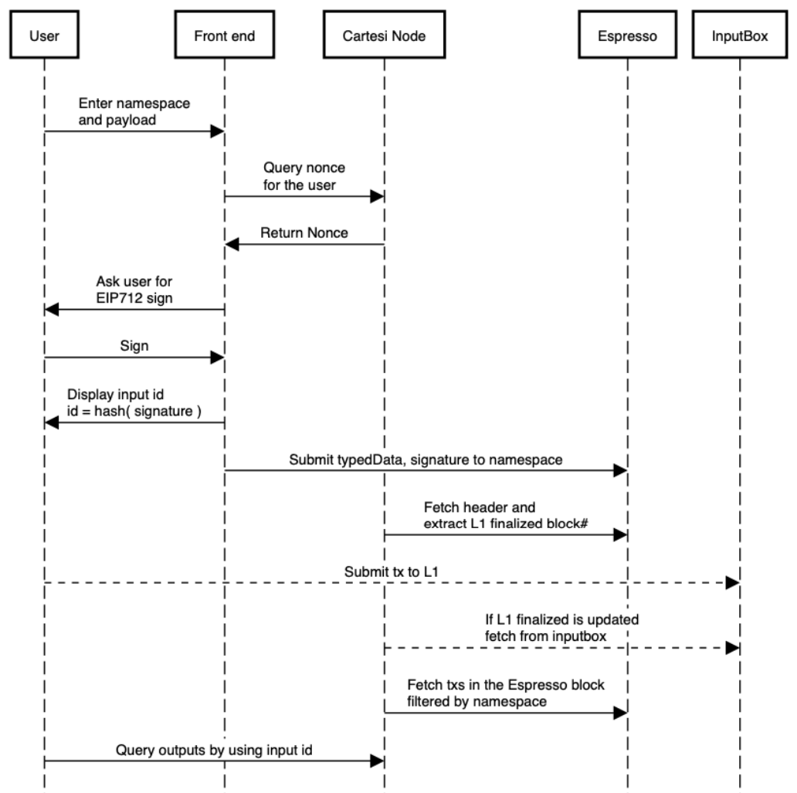

# Cartesi+Espresso App Development

From the developer’s point of view, creating a Cartesi app with Espresso integration is very similar to a standard Cartesi app.

- For the **application back-end**, both [L2 transactions](architecture.md#l2-transactions) and [L1->L2 messages](architecture.md#l1-l2-messages) are received as regular inputs;
- For the **application front-end**, [L2 transactions](architecture.md#l2-transactions) are signed by the client and then submitted to Espresso (convenience endpoints are provided on the node for facilitating this process), whereas [L1->L2 messages](architecture.md#l1-l2-messages) are submitted exactly in the same way as regular Cartesi Rollups inputs (i.e., as a transaction that eventually calls the InputBox contract’s `addInput` method)

## Submitting L2 transactions via Espresso

### Getting a nonce

To send an L2 transaction, first of all the client needs to define a `nonce` value for that transaction.
This value can be obtained by submitting an HTTP POST request to the new `/nonce` convenience endpoint provided on the Cartesi Node, giving as parameters the application’s address and the sender’s address:

```
POST /nonce

Body: {
  "app_contract": "0xAppAddress",
  "msg_sender": "0xSenderAddress"
}

Response: {
  "nonce": <nonce>
}
```

where the returned value is expected to be a `bigint` (e.g., `1n`).

### Signing a transaction

The client code then needs to build an EIP-712 TypedData structure containing the transaction data, and have it signed (e.g., via Metamask). This TypedData will include the definition of the EIP-712 domain and message structure for Cartesi transactions, along with the actual message data, as defined below:

```json
"typedData": {
  "domain": {
    "name": "Cartesi",
    "version": "0.1.0",
    "chainId": <chainId>,
    "verifyingContract": "0x0000000000000000000000000000000000000000"
  "types": {
    "EIP712Domain": [
      { "name": "name", "type": "string" },
      { "name": "version", "type": "string" },
      { "name": "chainId", "type": "uint256" },
      { "name": "verifyingContract", "type": "address" }
    ],
    "CartesiMessage": [
      { "name": "app", "type": "address" },
      { "name": "nonce", "type": "uint64" },
      { "name": "max_gas_price", "type": "uint128" },
      { "name": "data", "type": "bytes" }
    ],
  },
  "primaryType": "CartesiMessage",
  "message": {
     "app": "0xAppAddress",
     "nonce": <nonce>,
     "max_gas_price": "0",
     "data": "0xData"
  }
}
```

where:
- `chainId` is the base layer’s chain ID (e.g., `11155111` for Sepolia)
- `app` is the application’s deployment address on the base layer
- `nonce` is the value retrieved from the /nonce endpoint (as explained above)
- `data` is the actual transaction payload

_Note_: there will be a future use for the `verifyingContract` and `max_gas_price` parameters, but these will remain unused for now.

### Submitting the signed transaction

Once the user signs the EIP-712 TypedData, the client should submit an HTTP POST request to the new `/submit` convenience endpoint of the Cartesi Node, whose body should include the TypedData structure along with the signature and, optionally, the user account that signed it:

```
POST /submit

Body: {
  "typedData": <typedData>,
  "signature": "0xSignature",
  "account": "0xSenderAddress"
}

Responses:
  200: transaction id as a string
  { "id": "tx-id" }
```

where `typedData` is the exact same structure that was signed.

If successful, the return value of the request is the L2 transaction’s identifier, which can be used to retrieve information such as related outputs via the GraphQL API.

## Sequence diagram

A full sequence diagram is given below:



